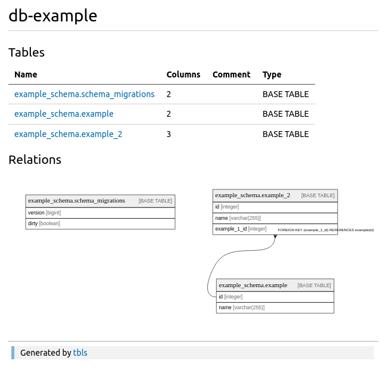

# tblsrun

Generate database documentation from migration files. Uses [tbls](github.com/k1LoW/tbls) internally to generate the docs.
Useful for reviewing database schema change in your team.

## How it works?
It works by spawning a database, then it will run the migrations files, and run the `tbls` to generate the db doc.

Currently it only support `postgres` for the DB & [golang-migrate](https://github.com/golang-migrate/migrate) for migration files format

## Example Database

Here is the example database documentation [link](/example/dbdoc/README.md)

### Snippets



## Installation
```
go install github.com/fahmifan/tblsrun/cmd/tblsrun@latest
```

## How To Use
- Set env variables, you can use `.env.example` as a reference.
- Create tbls config (see `example.tbls.yml`)
- Then run `tbslrun`, e.g.: `tblsrun postgres docker`
  - Currently it only support `postgres` with 2 modes `embedded` or `docker`
    - `embedded` will run postgres binary as child process
    - `docker` will spawn a postgres docker container, you need docker installed to use this
  - When running, it will install the latest `tbls` automatically if not exists in the `$PATH`

### Environtment Variables
- `TBLS_DATABASE_NAME`
  - your database name, it will be use in the generated doc
- `TBLS_DATABASE_SCHEMA`
  - your database schema, it will be use in the generated doc
- `TBLS_DATABASE_PORT`
  - override the default database port (e.g. postgres: 5432)
- `TBLS_MIGRATION_DIR`
  - the directory where your migration files are located 
  - currently only support `golang-migrate` format
- `TBLS_CONFIG_FILE`
  - the path to your `tbls` config file

### Available Commands
```
Generate database documentation from migration files

Usage:
  tblsrun [command]

Available Commands:
  help        Help about any command
  postgres    Run tbls with postgres

Flags:
  -h, --help   help for tblsrun
```
