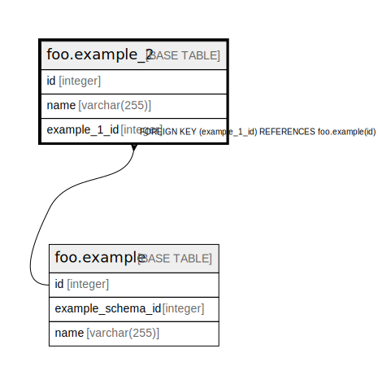

# foo.example_2

## Description

## Columns

| Name | Type | Default | Nullable | Children | Parents | Comment |
| ---- | ---- | ------- | -------- | -------- | ------- | ------- |
| id | integer | nextval('foo.example_2_id_seq'::regclass) | false |  |  |  |
| name | varchar(255) |  | false |  |  |  |
| example_1_id | integer |  | false |  | [foo.example](foo.example.md) |  |

## Constraints

| Name | Type | Definition |
| ---- | ---- | ---------- |
| example_2_example_1_id_fkey | FOREIGN KEY | FOREIGN KEY (example_1_id) REFERENCES foo.example(id) |
| example_2_pkey | PRIMARY KEY | PRIMARY KEY (id) |

## Indexes

| Name | Definition |
| ---- | ---------- |
| example_2_pkey | CREATE UNIQUE INDEX example_2_pkey ON foo.example_2 USING btree (id) |

## Relations

---

> Generated by [tbls](https://github.com/k1LoW/tbls)
